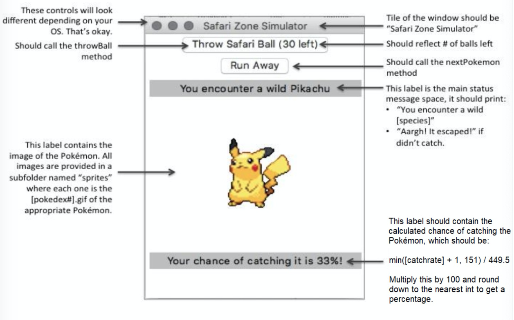

# Pokemon Safari GUI

This repo is for Python Final Project. In this project, I created a graphical user interface (GUI) that allows the user to play Pokémon Safari, a simple minigame within Pokémon in which the player has a set number of Safari balls to use to catch as many Pokémon as possible.  There are no battles within this minigame, so the user must do one of the following each turn:

### There are no battles within this minigame, so the user must do one of the following each turn:
1. Throw a Safari ball at the Pokémon to try and capture it, which has a random chance of success that depends on the Pokémon’s species.
2. Run away and find another Pokémon.
3. Throw a rock at the Pokémon, which increases the chance of capture but also increases the chance that the Pokémon will run away on its turn.
4. Throw bait at the Pokémon, which decreases the chance of capture but also decreases the chance that the Pokémon will run away on its turn.

### File needed to use:
1. A python file which contains the skeleton of your program, outlining the classes and methods required and providing details.
2. pokedex.csv, a CSV file which contains the dex number, name, catch rate, and speed of each of the 151 original species of Pokémon.
3. sprites, a folder which contains GIF images of each Pokémon, ordered by dex number.

### The standard GUI should look like this:

